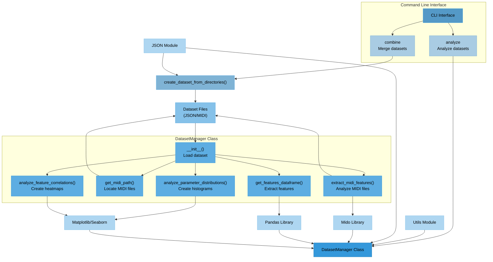

```mermaid
flowchart TD
    %% External dependencies
    Mido["Mido Library"]:::external
    Pandas["Pandas Library"]:::external
    Matplotlib["Matplotlib/Seaborn"]:::external
    Json["JSON Module"]:::external
    Utils["Utils Module"]:::external

    %% Main Components
    DatasetManager["DatasetManager Class"]:::primary
    Dataset["Dataset Files\n(JSON/MIDI)"]:::storage
    CombineFunction["create_dataset_from_directories()"]:::function
    MainScript["CLI Interface"]:::interface

    %% DatasetManager Methods
    DM_Init["__init__()\nLoad dataset"]:::method
    DM_Features["get_features_dataframe()\nExtract features"]:::method
    DM_MIDI["get_midi_path()\nLocate MIDI files"]:::method
    DM_Analyze1["analyze_parameter_distributions()\nCreate histograms"]:::method
    DM_Analyze2["analyze_feature_correlations()\nCreate heatmaps"]:::method
    DM_Extract["extract_midi_features()\nAnalyze MIDI files"]:::method

    %% Subgraph for DatasetManager
    subgraph "DatasetManager Class"
        DM_Init --> DM_Features
        DM_Init --> DM_MIDI
        DM_Init --> DM_Analyze1
        DM_Init --> DM_Analyze2
        DM_Init --> DM_Extract
    end

    %% Subgraph for CLI
    subgraph "Command Line Interface"
        Command1["combine\nMerge datasets"]:::command
        Command2["analyze\nAnalyze datasets"]:::command
        MainScript --> Command1
        MainScript --> Command2
    end

    %% Data Flow
    Dataset --> DM_Init
    DM_Features --> Pandas
    DM_MIDI --> Dataset
    DM_Analyze1 --> Matplotlib
    DM_Analyze2 --> Matplotlib
    DM_Extract --> Mido
    DM_Extract --> Dataset

    Command1 --> CombineFunction
    Command2 --> DatasetManager
    CombineFunction --> Dataset
    Utils --> DatasetManager
    Json --> DatasetManager
    Json --> CombineFunction

    %% External interactions
    Mido --> DatasetManager
    Pandas --> DatasetManager
    Matplotlib --> DatasetManager

    %% Click events for components
    click DatasetManager "dataset.py"
    click CombineFunction "dataset.py"
    click MainScript "dataset.py"
    click Utils "utils.py"

    %% Class definitions for styling
    classDef primary fill:#3498db,stroke:#2980b9,color:black
    classDef method fill:#5dade2,stroke:#3498db,color:black
    classDef function fill:#7fb3d5,stroke:#5dade2,color:black
    classDef storage fill:#85c1e9,stroke:#5dade2,color:black
    classDef external fill:#aed6f1,stroke:#85c1e9,color:black
    classDef interface fill:#5499c7,stroke:#3498db,color:black
    classDef command fill:#a9cce3,stroke:#7fb3d5,color:black
```