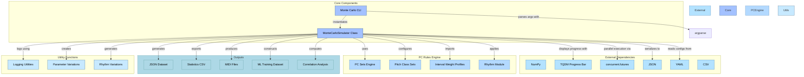

```mermaid
flowchart TD
    subgraph "External Dependencies"
        style External fill:#b3e2ff,stroke:#4682b4
        numpy["NumPy"]:::external
        tqdm["TQDM Progress Bar"]:::external
        futures["concurrent.futures"]:::external
        json["JSON"]:::external
        yaml["YAML"]:::external
        csv["CSV"]:::external
    end

    subgraph "Core Components"
        style Core fill:#a3c1ff,stroke:#2d5986
        MCS["MonteCarloSimulator Class"]:::core
        MCM["Monte Carlo CLI"]:::core
    end

    subgraph "PC Rules Engine"
        style PCEngine fill:#b3d9ff,stroke:#5b8cb9
        Engine["PC Sets Engine"]:::pcengine
        PCSETS["Pitch Class Sets"]:::pcengine
        IWP["Interval Weight Profiles"]:::pcengine
        Rhythm["Rhythm Module"]:::pcengine
    end

    subgraph "Outputs"
        style Outputs fill:#add8e6,stroke:#5f9ea0
        Dataset["JSON Dataset"]:::outputs
        CSV["Statistics CSV"]:::outputs
        MIDI["MIDI Files"]:::outputs
        TrainingSet["ML Training Dataset"]:::outputs
        Analysis["Correlation Analysis"]:::outputs
    end

    subgraph "Utility Functions"
        style Utils fill:#c7e9ff,stroke:#4a6f8a
        Logger["Logging Utilities"]:::utils
        Variations["Parameter Variations"]:::utils
        RhythmVar["Rhythm Variations"]:::utils
    end

    %% Connections
    MCS -->|"uses"| Engine
    MCS -->|"configures"| PCSETS
    MCS -->|"imports"| IWP
    MCS -->|"applies"| Rhythm
    
    MCS -->|"generates"| Dataset
    MCS -->|"exports"| CSV
    MCS -->|"produces"| MIDI
    MCS -->|"constructs"| TrainingSet
    MCS -->|"computes"| Analysis
    
    MCM -->|"instantiates"| MCS
    MCM -->|"parses args with"| argparse
    
    MCS -->|"logs using"| Logger
    MCS -->|"displays progress with"| tqdm
    MCS -->|"parallel execution via"| futures
    MCS -->|"serializes to"| json
    MCS -->|"reads configs from"| yaml
    
    MCS -->|"creates"| Variations
    MCS -->|"generates"| RhythmVar
    
    %% Click events
    click MCS "monte_carlo.py"
    click MCM "monte_carlo.py"
    click Engine "pc_sets/engine.py"
    click PCSETS "pc_sets/pitch_classes.py"
    click IWP "pc_sets/pitch_classes.py"
    click Rhythm "pc_sets/rhythm.py"
    click Logger "utils.py"
    
    %% Class definitions
    classDef external fill:#b3e2ff,stroke:#4682b4,color:black
    classDef core fill:#a3c1ff,stroke:#2d5986,color:black
    classDef pcengine fill:#b3d9ff,stroke:#5b8cb9,color:black
    classDef utils fill:#c7e9ff,stroke:#4a6f8a,color:black
    classDef outputs fill:#add8e6,stroke:#5f9ea0,color:black
```