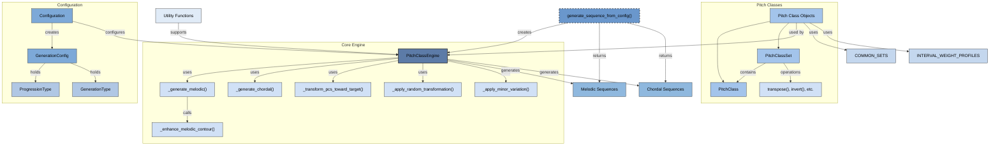

```mermaid
flowchart TD
    %% Main Components
    Config["Configuration"]:::config
    Engine["PitchClassEngine"]:::core
    GenConfig["GenerationConfig"]:::config
    PCObjects["Pitch Class Objects"]:::model
    Utils["Utility Functions"]:::util
    
    %% Output Components
    MelodicSeq["Melodic Sequences"]:::output
    ChordalSeq["Chordal Sequences"]:::output
    
    %% Subcomponents
    subgraph "Core Engine"
        Engine --> |"uses"| GenMelodic["_generate_melodic()"]:::method
        Engine --> |"uses"| GenChordal["_generate_chordal()"]:::method
        Engine --> |"uses"| Transform["_transform_pcs_toward_target()"]:::method
        Engine --> |"uses"| RandomTransform["_apply_random_transformation()"]:::method
        Engine --> |"uses"| MinorVar["_apply_minor_variation()"]:::method
        GenMelodic --> |"calls"| EnhanceContour["_enhance_melodic_contour()"]:::method
    end
    
    subgraph "Pitch Classes"
        PCObjects --> PCSingle["PitchClass"]:::model
        PCObjects --> PCSet["PitchClassSet"]:::model
        PCSet --> |"contains"| PCSingle
        PCSet --> |"operations"| PCOperations["transpose(), invert(), etc."]:::method
    end
    
    subgraph "Configuration"
        GenConfig --> |"holds"| ProgType["ProgressionType"]:::enum
        GenConfig --> |"holds"| GenType["GenerationType"]:::enum
        Config --> |"creates"| GenConfig
    end
    
    %% Main Flow
    Config --> |"configures"| Engine
    PCObjects --> |"used by"| Engine
    Utils --> |"supports"| Engine
    
    %% Outputs
    Engine --> |"generates"| MelodicSeq
    Engine --> |"generates"| ChordalSeq
    
    %% Public Interface
    GenSequence["generate_sequence_from_config()"]:::public
    GenSequence --> |"creates"| Engine
    GenSequence --> |"returns"| MelodicSeq
    GenSequence --> |"returns"| ChordalSeq
    
    %% Special Components
    CommonSets["COMMON_SETS"]:::data
    IntervalProfiles["INTERVAL_WEIGHT_PROFILES"]:::data
    PCObjects --> |"uses"| CommonSets
    PCObjects --> |"uses"| IntervalProfiles
    
    %% Styling
    classDef core fill:#5c7ba7,stroke:#333,stroke-width:2px,color:black
    classDef config fill:#7da9d8,stroke:#333,stroke-width:1px,color:black
    classDef model fill:#a3c4eb,stroke:#333,stroke-width:1px,color:black
    classDef method fill:#d1e1f6,stroke:#333,stroke-width:1px,color:black
    classDef enum fill:#b0c7e4,stroke:#333,stroke-width:1px,color:black
    classDef output fill:#8fb8de,stroke:#333,stroke-width:1px,color:black
    classDef public fill:#6a97cc,stroke:#333,stroke-width:2px,stroke-dasharray: 5 5,color:black
    classDef data fill:#c4d7ee,stroke:#333,stroke-width:1px,color:black
    classDef util fill:#e0ebf7,stroke:#333,stroke-width:1px,color:black
    
    %% Click Events
    click Engine "pc_sets/engine.py"
    click GenConfig "pc_sets/engine.py"
    click PCObjects "pc_sets/pitch_classes.py"
    click Utils "utils/__init__.py"
    click GenSequence "pc_sets/engine.py"
    click CommonSets "pc_sets/pitch_classes.py"
    click IntervalProfiles "pc_sets/pitch_classes.py"
```