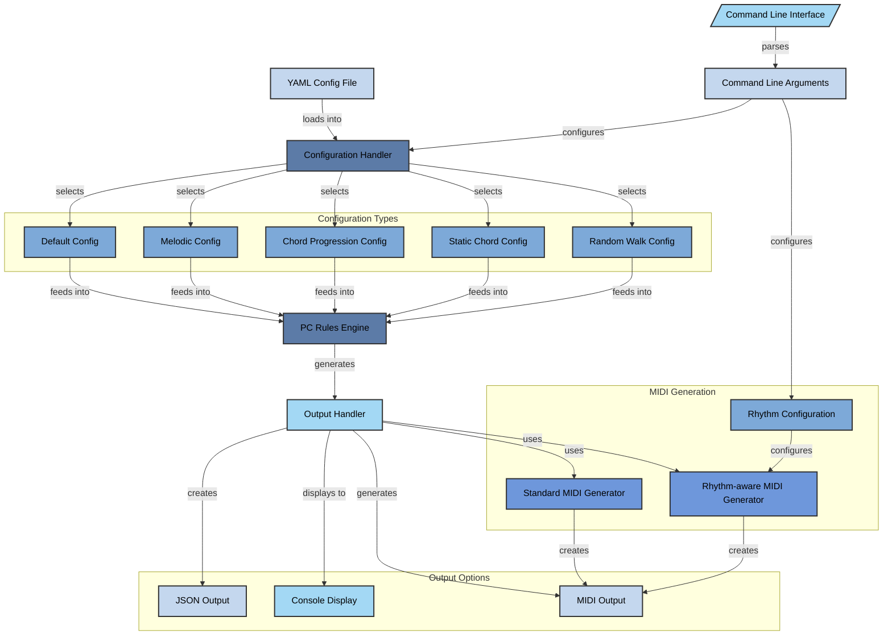

```mermaid
flowchart TD
    %% Main components
    CLI[/"Command Line Interface"/]:::interface
    Config["Configuration Handler"]:::core
    Engine["PC Rules Engine"]:::core
    Output["Output Handler"]:::interface

    %% Input sources
    YAMLConfig["YAML Config File"]:::data
    CLIArgs["Command Line Arguments"]:::data

    %% Config types
    subgraph "Configuration Types"
        Default["Default Config"]:::config
        Melodic["Melodic Config"]:::config
        ChordProg["Chord Progression Config"]:::config 
        StaticChord["Static Chord Config"]:::config
        RandomWalk["Random Walk Config"]:::config
    end

    %% Output types
    subgraph "Output Options"
        JSONOutput["JSON Output"]:::data
        MIDIOutput["MIDI Output"]:::data
        ConsoleDisplay["Console Display"]:::interface
    end

    %% MIDI generation components
    subgraph "MIDI Generation"
        StandardMIDI["Standard MIDI Generator"]:::module
        RhythmMIDI["Rhythm-aware MIDI Generator"]:::module
        RhythmConfig["Rhythm Configuration"]:::config
    end

    %% Sequence generation flow
    CLI -->|"parses"| CLIArgs
    CLIArgs -->|"configures"| Config
    YAMLConfig -->|"loads into"| Config
    Config -->|"selects"| Default
    Config -->|"selects"| Melodic
    Config -->|"selects"| ChordProg
    Config -->|"selects"| StaticChord
    Config -->|"selects"| RandomWalk
    
    Default -->|"feeds into"| Engine
    Melodic -->|"feeds into"| Engine
    ChordProg -->|"feeds into"| Engine
    StaticChord -->|"feeds into"| Engine
    RandomWalk -->|"feeds into"| Engine
    
    Engine -->|"generates"| Output
    Output -->|"creates"| JSONOutput
    Output -->|"displays to"| ConsoleDisplay
    Output -->|"generates"| MIDIOutput
    
    CLIArgs -->|"configures"| RhythmConfig
    RhythmConfig -->|"configures"| RhythmMIDI
    Output -->|"uses"| StandardMIDI
    Output -->|"uses"| RhythmMIDI
    StandardMIDI -->|"creates"| MIDIOutput
    RhythmMIDI -->|"creates"| MIDIOutput

    %% Click events
    click CLI "/Users/finchmf/coding/control_vectors/pc_rules_engine/run_engine.py"
    click Config "/Users/finchmf/coding/control_vectors/pc_rules_engine/run_engine.py"
    click Engine "/Users/finchmf/coding/control_vectors/pc_rules_engine/pc_sets/engine.py"
    click Output "/Users/finchmf/coding/control_vectors/pc_rules_engine/run_engine.py"
    click StandardMIDI "/Users/finchmf/coding/control_vectors/pc_rules_engine/midi"
    click RhythmMIDI "/Users/finchmf/coding/control_vectors/pc_rules_engine/midi"
    click RhythmConfig "/Users/finchmf/coding/control_vectors/pc_rules_engine/pc_sets/rhythm.py"

    %% Styling
    classDef interface fill:#a3d8f4,stroke:#333,stroke-width:2px,color:black
    classDef core fill:#5c7ba7,stroke:#333,stroke-width:2px,color:black
    classDef data fill:#c4d7ee,stroke:#333,stroke-width:2px,color:black
    classDef config fill:#7da9d8,stroke:#333,stroke-width:2px,color:black
    classDef module fill:#6e97db,stroke:#333,stroke-width:2px,color:black
```