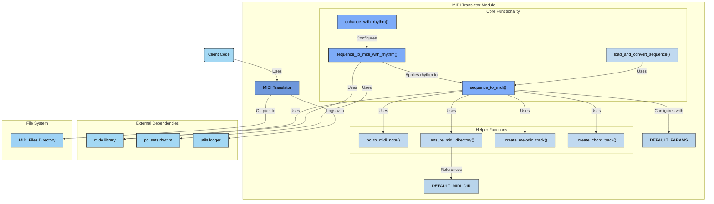

```mermaid
flowchart TD
    %% Main Components
    User("Client Code"):::external
    
    subgraph "MIDI Translator Module"
        Translator["MIDI Translator"]:::core
        
        subgraph "Core Functionality"
            SequenceToMIDI["sequence_to_midi()"]:::primary
            RhythmEnhancer["enhance_with_rhythm()"]:::primary
            SequenceWithRhythm["sequence_to_midi_with_rhythm()"]:::primary
            LoadConvert["load_and_convert_sequence()"]:::utility
        end
        
        subgraph "Helper Functions"
            PCToMIDI["pc_to_midi_note()"]:::utility
            MIDIPath["_ensure_midi_directory()"]:::utility
            MelodicTrack["_create_melodic_track()"]:::utility
            ChordTrack["_create_chord_track()"]:::utility
        end
        
        %% Configuration
        DefaultParams["DEFAULT_PARAMS"]:::config
        MIDIDir["DEFAULT_MIDI_DIR"]:::config
    end
    
    subgraph "External Dependencies"
        MIDO["mido library"]:::external
        PCRhythm["pc_sets.rhythm"]:::external
        Logger["utils.logger"]:::external
    end
    
    subgraph "File System"
        MidiFiles["MIDI Files Directory"]:::storage
    end
    
    %% Connections between components
    User -->|"Uses"| Translator
    Translator -->|"Outputs to"| MidiFiles
    
    SequenceToMIDI -->|"Uses"| PCToMIDI
    SequenceToMIDI -->|"Uses"| MIDIPath
    SequenceToMIDI -->|"Uses"| MelodicTrack
    SequenceToMIDI -->|"Uses"| ChordTrack
    SequenceToMIDI -->|"Configures with"| DefaultParams
    
    SequenceWithRhythm -->|"Applies rhythm to"| SequenceToMIDI
    SequenceWithRhythm -->|"Uses"| PCRhythm
    
    LoadConvert -->|"Uses"| SequenceToMIDI
    
    RhythmEnhancer -->|"Configures"| SequenceWithRhythm
    
    MIDIPath -->|"References"| MIDIDir
    
    %% External dependencies
    SequenceToMIDI -->|"Uses"| MIDO
    SequenceWithRhythm -->|"Uses"| MIDO
    Translator -->|"Logs with"| Logger
    
    %% Click events
    click Translator "midi/translator.py"
    click SequenceToMIDI "midi/translator.py"
    click RhythmEnhancer "midi/translator.py"
    click SequenceWithRhythm "midi/translator.py"
    click LoadConvert "midi/translator.py"
    click PCToMIDI "midi/translator.py"
    click MIDIPath "midi/translator.py"
    click MelodicTrack "midi/translator.py"
    click ChordTrack "midi/translator.py"
    click MidiFiles "midi_files"
    click PCRhythm "pc_sets/rhythm.py"
    
    %% Styles
    classDef external fill:#a3d8f4,stroke:#333,stroke-width:2px,color:black
    classDef primary fill:#7dabf8,stroke:#333,stroke-width:2px,color:black
    classDef utility fill:#c0d9f0,stroke:#333,stroke-width:1px,color:black
    classDef core fill:#6e97db,stroke:#333,stroke-width:2px,color:black
    classDef config fill:#b8d4eb,stroke:#333,stroke-width:1px,color:black
    classDef storage fill:#9ed2f5,stroke:#333,stroke-width:1px,color:black
```