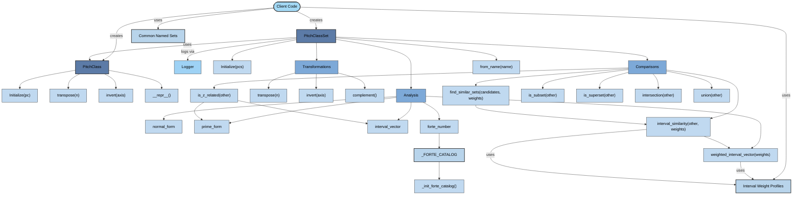

```mermaid
flowchart TD
    %% Main Components
    User(["Client Code"]):::external
    PitchClass["PitchClass"]:::core
    PitchClassSet["PitchClassSet"]:::core
    IntervalWeights["Interval Weight Profiles"]:::data
    CommonSets["Common Named Sets"]:::data
    Logger["Logger"]:::utility

    %% PitchClass Operations
    PCInit["Initialize(pc)"]:::operation
    PCTranspose["transpose(n)"]:::operation
    PCInvert["invert(axis)"]:::operation
    PCRepresent["__repr__()"]:::operation

    %% PitchClassSet Operations
    PCSInit["Initialize(pcs)"]:::operation
    PCSTransform["Transformations"]:::group
    PCSAnalysis["Analysis"]:::group
    PCSCompare["Comparisons"]:::group
    
    %% Transformation Operations
    Transpose["transpose(n)"]:::operation
    Invert["invert(axis)"]:::operation
    Complement["complement()"]:::operation
    
    %% Analysis Operations
    NormalForm["normal_form"]:::operation
    PrimeForm["prime_form"]:::operation
    IntervalVector["interval_vector"]:::operation
    WeightedVector["weighted_interval_vector(weights)"]:::operation
    ForteNumber["forte_number"]:::operation
    ForteCatalog["_FORTE_CATALOG"]:::data
    InitForteCatalog["_init_forte_catalog()"]:::operation
    
    %% Comparison Operations
    IntervalSimilarity["interval_similarity(other, weights)"]:::operation
    FindSimilarSets["find_similar_sets(candidates, weights)"]:::operation
    ZRelated["is_z_related(other)"]:::operation
    IsSubset["is_subset(other)"]:::operation
    IsSuperset["is_superset(other)"]:::operation
    Intersection["intersection(other)"]:::operation
    Union["union(other)"]:::operation

    %% Factory Methods
    FromName["from_name(name)"]:::operation
    
    %% Relationships
    User -->|"creates"| PitchClass
    User -->|"creates"| PitchClassSet
    User -->|"uses"| CommonSets
    User -->|"uses"| IntervalWeights
    
    PitchClass --> PCInit
    PitchClass --> PCTranspose
    PitchClass --> PCInvert
    PitchClass --> PCRepresent
    
    PitchClassSet --> PCSInit
    PitchClassSet --> PCSTransform
    PitchClassSet --> PCSAnalysis
    PitchClassSet --> PCSCompare
    PitchClassSet --> FromName
    
    PCSTransform --> Transpose
    PCSTransform --> Invert
    PCSTransform --> Complement
    
    PCSAnalysis --> NormalForm
    PCSAnalysis --> PrimeForm
    PCSAnalysis --> IntervalVector
    PCSAnalysis --> WeightedVector
    PCSAnalysis --> ForteNumber
    ForteNumber --> ForteCatalog
    ForteCatalog --> InitForteCatalog
    
    PCSCompare --> IntervalSimilarity
    PCSCompare --> FindSimilarSets
    PCSCompare --> ZRelated
    PCSCompare --> IsSubset
    PCSCompare --> IsSuperset
    PCSCompare --> Intersection
    PCSCompare --> Union
    
    IntervalSimilarity --> WeightedVector
    FindSimilarSets --> IntervalSimilarity
    ZRelated --> IntervalVector
    ZRelated --> PrimeForm
    
    PitchClassSet -->|"uses"| PitchClass
    WeightedVector -->|"uses"| IntervalWeights
    IntervalSimilarity -->|"uses"| IntervalWeights
    
    PitchClassSet -->|"logs via"| Logger
    
    %% Click events
    click PitchClass "pc_sets/pitch_classes.py"
    click PitchClassSet "pc_sets/pitch_classes.py"
    click IntervalWeights "pc_sets/pitch_classes.py"
    click CommonSets "pc_sets/pitch_classes.py"
    click Logger "utils/logging_setup.py"

    %% Styling classes
    classDef external fill:#a3d8f4,stroke:#333,stroke-width:2px,color:black
    classDef core fill:#5c7ba7,stroke:#333,stroke-width:2px,color:black
    classDef operation fill:#c0d9f0,stroke:#333,stroke-width:1px,color:black
    classDef group fill:#7da9d8,stroke:#333,stroke-width:1px,color:black
    classDef data fill:#b8d4eb,stroke:#333,stroke-width:2px,color:black
    classDef utility fill:#9ed2f5,stroke:#333,stroke-width:1px,color:black
```