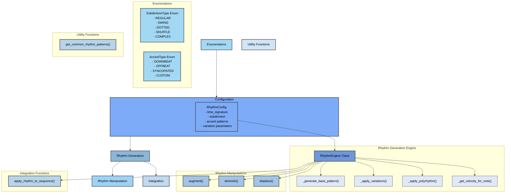

```mermaid
flowchart TD
    %% Main Components
    Enums["Enumerations"]:::enum
    Configuration["Configuration"]:::config
    RhythmGeneration["Rhythm Generation"]:::generation
    RhythmManipulation["Rhythm Manipulation"]:::manipulation
    Integration["Integration"]:::integration
    UtilityFunctions["Utility Functions"]:::utility

    %% Subcomponents
    subgraph "Enumerations"
        SubdivisionType["SubdivisionType Enum\n- REGULAR\n- SWING\n- DOTTED\n- SHUFFLE\n- COMPLEX"]:::enum
        AccentType["AccentType Enum\n- DOWNBEAT\n- OFFBEAT\n- SYNCOPATED\n- CUSTOM"]:::enum
    end

    subgraph "Configuration"
        RhythmConfig["RhythmConfig\n- time_signature\n- subdivision\n- accent patterns\n- variation parameters"]:::config
    end

    subgraph "Rhythm Generation Engine"
        RhythmEngine["RhythmEngine Class"]:::core
        BasePattern["_generate_base_pattern()"]:::internal
        ApplyVariations["_apply_variations()"]:::internal
        ApplyPolyrhythm["_apply_polyrhythm()"]:::internal
        GetVelocity["_get_velocity_for_note()"]:::internal
    end

    subgraph "Rhythm Manipulations"
        Augment["augment()"]:::method
        Diminish["diminish()"]:::method
        Displace["displace()"]:::method
    end

    subgraph "Integration Functions"
        ApplyRhythmToSequence["apply_rhythm_to_sequence()"]:::function
    end

    subgraph "Utility Functions"
        GetCommonPatterns["get_common_rhythm_patterns()"]:::function
    end

    %% Connections
    Enums --> Configuration
    Configuration --> RhythmGeneration
    RhythmGeneration --> RhythmManipulation
    RhythmGeneration --> Integration
    RhythmConfig --> RhythmEngine
    RhythmEngine --> BasePattern
    RhythmEngine --> ApplyVariations
    RhythmEngine --> ApplyPolyrhythm
    RhythmEngine --> GetVelocity
    RhythmEngine --> Augment
    RhythmEngine --> Diminish
    RhythmEngine --> Displace
    RhythmEngine --> ApplyRhythmToSequence

    %% Click events
    click RhythmConfig "pc_sets/rhythm.py"
    click RhythmEngine "pc_sets/rhythm.py"
    click SubdivisionType "pc_sets/rhythm.py"
    click AccentType "pc_sets/rhythm.py"
    click ApplyRhythmToSequence "pc_sets/rhythm.py"
    click GetCommonPatterns "pc_sets/rhythm.py"

    %% Styles - Cool color scheme with black text
    classDef enum fill:#a3d8f4,stroke:#333,stroke-width:2px,color:black
    classDef config fill:#7dabf8,stroke:#333,stroke-width:2px,color:black
    classDef core fill:#6e97db,stroke:#333,stroke-width:2px,color:black
    classDef method fill:#a4c3e8,stroke:#333,stroke-width:2px,color:black
    classDef internal fill:#e0e9f8,stroke:#333,stroke-width:1px,color:black
    classDef function fill:#b8d4eb,stroke:#333,stroke-width:2px,color:black
    classDef generation fill:#8cb6d8,stroke:#333,stroke-width:2px,color:black
    classDef manipulation fill:#9ed2f5,stroke:#333,stroke-width:2px,color:black
    classDef integration fill:#c0d9f0,stroke:#333,stroke-width:2px,color:black
    classDef utility fill:#d1e5f7,stroke:#333,stroke-width:2px,color:black
```