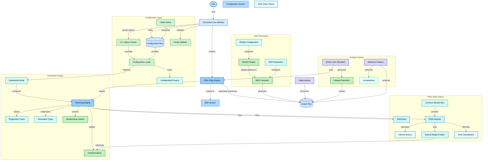

```mermaid
flowchart TD
    %% Main Components
    User(["User"]):::external
    CLI["Command-Line Interface"]:::interface
    ConfigSystem["Configuration System"]:::system
    Engine["Pitch Class Engine"]:::core
    PitchClassTheory["Pitch Class Theory"]:::theory
    MIDISystem["MIDI System"]:::system
    DataAnalysis["Data Analysis"]:::analytics
    OutputFiles[("Output Files")]:::storage

    %% Configuration Components
    subgraph "Configuration Layer"
        ConfigFiles[("Configuration Files")]:::storage
        ConfigLoader["Configuration Loader"]:::utility
        YAMLParser["YAML Parser"]:::utility
        CLIOptions["CLI Options Parser"]:::utility
        ConfigValidator["Config Validator"]:::utility
        Presets["Configuration Presets"]:::data
    end

    %% Core Engine Components
    subgraph "Generation Engine"
        PitchClassEngine["PitchClassEngine"]:::core
        GenerationConfig["GenerationConfig"]:::data
        ProgressionTypes["Progression Types"]:::data
        GenerationTypes["Generation Types"]:::data
        RandomnessControl["Randomness Control"]:::process
        Transformations["Transformations"]:::process
    end

    %% Pitch Class Theory Components
    subgraph "Pitch Class Theory"
        PitchClass["PitchClass"]:::object
        PitchClassSet["PitchClassSet"]:::object
        IntervalVectors["Interval Vectors"]:::theory
        WeightProfiles["Interval Weight Profiles"]:::data
        ForteClassification["Forte Classification"]:::theory
        CommonSets["Common Named Sets"]:::data
    end

    %% MIDI Components
    subgraph "MIDI Generation"
        MIDITranslator["MIDI Translator"]:::process
        RhythmEngine["Rhythm Engine"]:::process
        RhythmConfig["Rhythm Configuration"]:::data
        MIDIParameters["MIDI Parameters"]:::data
    end

    %% Analysis Components
    subgraph "Analysis System"
        MonteCarloSimulator["Monte Carlo Simulator"]:::analytics
        DatasetGenerator["Dataset Generator"]:::process
        StatisticalAnalysis["Statistical Analysis"]:::analytics
        Visualizations["Visualizations"]:::output
    end

    %% Connections - User Interaction
    User -->|"runs"| CLI
    CLI -->|"parses options"| CLIOptions
    CLI -->|"validates"| ConfigValidator
    CLI -->|"loads"| ConfigFiles
    CLIOptions -->|"overrides"| ConfigLoader
    ConfigFiles -->|"provides"| ConfigLoader
    YAMLParser -->|"processes"| ConfigFiles
    ConfigLoader -->|"loads"| Presets
    ConfigLoader -->|"initializes"| GenerationConfig

    %% Connections - Engine Workflow
    GenerationConfig -->|"configures"| PitchClassEngine
    PitchClassEngine -->|"uses"| PitchClass
    PitchClassEngine -->|"uses"| PitchClassSet
    PitchClassEngine -->|"applies"| Transformations
    PitchClassEngine -->|"controls"| RandomnessControl
    PitchClassEngine -->|"follows"| ProgressionTypes
    PitchClassEngine -->|"implements"| GenerationTypes
    CLI -->|"invokes"| Engine
    Engine -->|"creates"| PitchClassEngine
    Engine -->|"generates sequences"| OutputFiles

    %% Connections - Pitch Class Theory
    PitchClassSet -->|"calculates"| IntervalVectors
    PitchClassSet -->|"uses"| WeightProfiles
    PitchClassSet -->|"identifies"| ForteClassification
    WeightProfiles -->|"influences"| Transformations
    CommonSets -->|"provides"| PitchClassSet

    %% Connections - MIDI Output
    Engine -->|"outputs to"| MIDISystem
    RhythmEngine -->|"applies patterns to"| MIDITranslator
    RhythmConfig -->|"configures"| RhythmEngine
    MIDIParameters -->|"configures"| MIDITranslator
    MIDITranslator -->|"generates"| OutputFiles

    %% Connections - Analysis
    DataAnalysis -->|"processes"| OutputFiles
    MonteCarloSimulator -->|"uses"| Engine
    MonteCarloSimulator -->|"generates"| DatasetGenerator
    DatasetGenerator -->|"creates"| OutputFiles
    StatisticalAnalysis -->|"analyzes"| OutputFiles
    StatisticalAnalysis -->|"produces"| Visualizations

    %% Click events
    click CLI "run_engine.py"
    click ConfigFiles "configs"
    click ConfigLoader "run_engine.py"
    click YAMLParser "run_engine.py"
    click CLIOptions "run_engine.py"
    click Presets "run_engine.py"
    click Engine "pc_sets/engine.py"
    click PitchClassEngine "pc_sets/engine.py"
    click GenerationConfig "pc_sets/engine.py"
    click ProgressionTypes "pc_sets/engine.py"
    click GenerationTypes "pc_sets/engine.py"
    click Transformations "pc_sets/engine.py"
    click RandomnessControl "pc_sets/engine.py"
    click PitchClass "pc_sets/pitch_classes.py"
    click PitchClassSet "pc_sets/pitch_classes.py"
    click IntervalVectors "pc_sets/pitch_classes.py"
    click WeightProfiles "pc_sets/pitch_classes.py"
    click ForteClassification "pc_sets/pitch_classes.py"
    click CommonSets "pc_sets/pitch_classes.py"
    click MIDITranslator "midi/translator.py"
    click RhythmEngine "pc_sets/rhythm.py"
    click RhythmConfig "pc_sets/rhythm.py"
    click MonteCarloSimulator "monte_carlo.py"
    click DatasetGenerator "monte_carlo.py"
    click StatisticalAnalysis "analysis"
    click Visualizations "analysis"

    %% Styling - Cool Color Scheme with Black Text
    classDef external fill:#c3e6ff,stroke:#0077be,stroke-width:2px,color:black
    classDef interface fill:#d6eaff,stroke:#4682b4,stroke-width:2px,color:black
    classDef system fill:#b3d9ff,stroke:#1e90ff,stroke-width:2px,color:black
    classDef core fill:#99ccff,stroke:#0066cc,stroke-width:2px,color:black
    classDef object fill:#ccf2ff,stroke:#00acc1,stroke-width:2px,color:black
    classDef theory fill:#e6f9ff,stroke:#00838f,stroke-width:2px,color:black
    classDef process fill:#c2f0c2,stroke:#2e8b57,stroke-width:2px,color:black
    classDef utility fill:#d1f0d1,stroke:#3cb371,stroke-width:2px,color:black
    classDef data fill:#d4f7f7,stroke:#20b2aa,stroke-width:2px,color:black
    classDef storage fill:#cce6ff,stroke:#4169e1,stroke-width:2px,color:black
    classDef output fill:#e0ffff,stroke:#48d1cc,stroke-width:2px,color:black
    classDef analytics fill:#d8d8f6,stroke:#6a5acd,stroke-width:2px,color:black
```