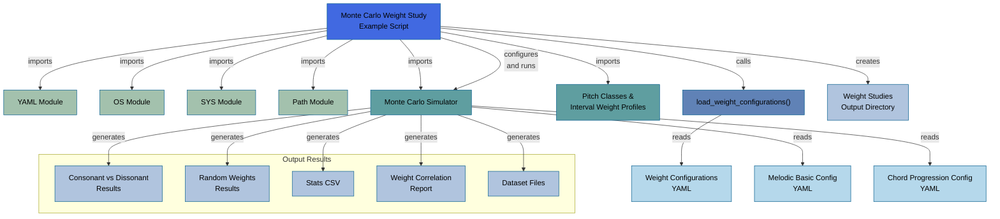

```mermaid
flowchart TD
    %% External Components
    YAML["YAML Module"]:::external
    OS["OS Module"]:::external
    SYS["SYS Module"]:::external
    PATH["Path Module"]:::external

    %% Configuration Files
    WeightConfig["Weight Configurations\nYAML"]:::config
    MelodicConfig["Melodic Basic Config\nYAML"]:::config
    ChordConfig["Chord Progression Config\nYAML"]:::config

    %% Core Components
    MainScript["Monte Carlo Weight Study\nExample Script"]:::main
    MonteCarloSim["Monte Carlo Simulator"]:::core
    PitchClasses["Pitch Classes &\nInterval Weight Profiles"]:::core
    
    %% Functions
    LoadWeights["load_weight_configurations()"]:::function
    
    %% Outputs
    OutputDir["Weight Studies\nOutput Directory"]:::output
    
    subgraph "Output Results"
        ConsonantDissonant["Consonant vs Dissonant\nResults"]:::output
        RandomWeights["Random Weights\nResults"]:::output
        CSV["Stats CSV"]:::output
        JSON["Weight Correlation\nReport"]:::output
        Dataset["Dataset Files"]:::output
    end
    
    %% Flow
    MainScript -->|"imports"| YAML
    MainScript -->|"imports"| OS
    MainScript -->|"imports"| SYS
    MainScript -->|"imports"| PATH
    MainScript -->|"imports"| MonteCarloSim
    MainScript -->|"imports"| PitchClasses
    
    MainScript -->|"calls"| LoadWeights
    LoadWeights -->|"reads"| WeightConfig
    
    MainScript -->|"creates"| OutputDir
    
    MainScript -->|"configures\nand runs"| MonteCarloSim
    MonteCarloSim -->|"reads"| MelodicConfig
    MonteCarloSim -->|"reads"| ChordConfig
    
    MonteCarloSim -->|"generates"| ConsonantDissonant
    MonteCarloSim -->|"generates"| RandomWeights
    MonteCarloSim -->|"generates"| CSV
    MonteCarloSim -->|"generates"| JSON
    MonteCarloSim -->|"generates"| Dataset
    
    %% Click events
    click MainScript "examples/monte_carlo_weight_study.py"
    click MonteCarloSim "monte_carlo/__init__.py"
    click PitchClasses "pc_sets/pitch_classes.py"
    click WeightConfig "configs/weight_configurations.yaml"
    click MelodicConfig "configs/melodic_basic.yaml"
    click ChordConfig "configs/chord_progression.yaml"
    
    %% Style definitions
    classDef external fill:#a3c1ad,stroke:#0c6291,color:black
    classDef config fill:#b5d8eb,stroke:#0c6291,color:black
    classDef core fill:#5f9ea0,stroke:#0c6291,color:black
    classDef function fill:#6082b6,stroke:#0c6291,color:black
    classDef main fill:#4169e1,stroke:#0c6291,color:black
    classDef output fill:#b0c4de,stroke:#0c6291,color:black
```